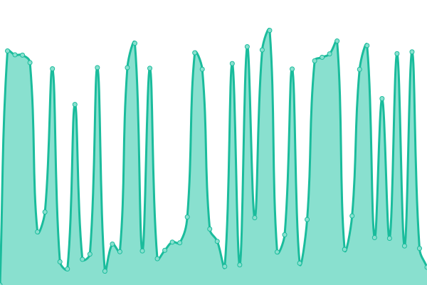

# [📈 Live Status](https://teledec.github.io/status): <!--live status--> **🟩 All systems operational**

This repository contains the open-source uptime monitor and status page for [House of Remote Sensing](https://www.teledetection.fr/index.php/en), powered by [Upptime](https://github.com/upptime/upptime).

With [Upptime](https://upptime.js.org), you can get your own unlimited and free uptime monitor and status page, powered entirely by a GitHub repository. We use [Issues](https://github.com/teledec/status/issues) as incident reports, [Actions](https://github.com/teledec/status/actions) as uptime monitors, and [Pages](https://teledec.github.io/status) for the status page.

<!--start: status pages-->
<!-- This summary is generated by Upptime (https://github.com/upptime/upptime) -->
<!-- Do not edit this manually, your changes will be overwritten -->
<!-- prettier-ignore -->
| URL | Status | History | Response Time | Uptime |
| --- | ------ | ------- | ------------- | ------ |
|  [STAC endpoint](https://api.stac.teledetection.fr) | 🟩 Up | [stac-endpoint.yml](https://github.com/teledec/status/commits/HEAD/history/stac-endpoint.yml) | 

 3533ms
     
 | 

<a href="https://teledec.github.io/status/history/stac-endpoint">91.21%</a>
    

|  [STAC endpoint for QGIS](https://qgis.stac.teledetection.fr) | 🟩 Up | [stac-endpoint-for-qgis.yml](https://github.com/teledec/status/commits/HEAD/history/stac-endpoint-for-qgis.yml) | 

 2900ms
     
 | 

<a href="https://teledec.github.io/status/history/stac-endpoint-for-qgis">91.40%</a>
    

|  [STAC browser](https://browser.stac.teledetection.fr) | 🟩 Up | [stac-browser.yml](https://github.com/teledec/status/commits/HEAD/history/stac-browser.yml) | 

 2445ms
     
 | 

<a href="https://teledec.github.io/status/history/stac-browser">91.60%</a>
    

|  [URL signing](https://signing.stac.teledetection.fr/docs) | 🟩 Up | [url-signing.yml](https://github.com/teledec/status/commits/HEAD/history/url-signing.yml) | 

 2803ms
     
 | 

<a href="https://teledec.github.io/status/history/url-signing">91.80%</a>
    

|  [Home](https://www.stac.teledetection.fr) | 🟩 Up | [home.yml](https://github.com/teledec/status/commits/HEAD/history/home.yml) | 

 2693ms
     
 | 

<a href="https://teledec.github.io/status/history/home">92.00%</a>
    

|  [API key management](https://gate.stac.teledetection.fr) | 🟩 Up | [api-key-management.yml](https://github.com/teledec/status/commits/HEAD/history/api-key-management.yml) | 

 3023ms
     
 | 

<a href="https://teledec.github.io/status/history/api-key-management">92.20%</a>
    

<!--end: status pages-->

[**Visit our status website →**](https://teledec.github.io/status)

## 📄 License

- Powered by: [Upptime](https://github.com/upptime/upptime)
- Code: [MIT](./LICENSE) © [Anand Chowdhary](https://anandchowdhary.com), supported by [Pabio](https://pabio.com)
- Data in the `./history` directory: [Open Database License](https://opendatacommons.org/licenses/odbl/1-0/)
